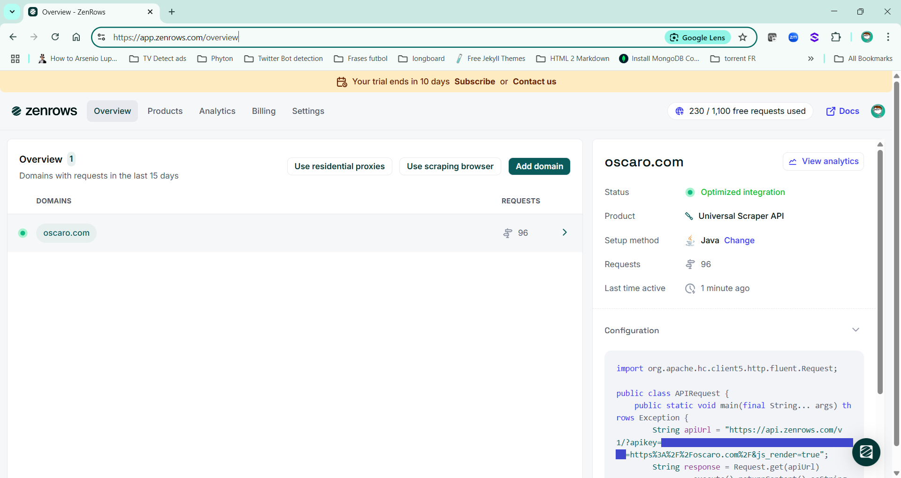

# OpenMock's `oscaro.com` Scrapper

```
Open Mock is a random data generator library for testing.
```

This web scrapper reads vehicle brands, families, models and types from [oscaro.com](https://www.oscaro.com)

## Execution

Distributed as an auto-runnable jar file can be executed from the command line.

Accepted parameters:

 - `--threads` or `-t`: (optinal) Number of simultaneous threads to be launched to process the page
 - `--lang` or `-l`: (optinal) Language to be used in the output. Supported languages:  es (Spanish), fr (French) and pt (Portuguese),
 - `--zen` or `-z`: (optinal) Flat to indicate that Zen Rows API must be used to bypass Cloudfare block to parse the page

 - Execution example:

```console 
java -jar oscaro-scrapper-25.08.jar --threads 8 --lang es
```

## Output

It generates a `csv` file for each brand. The `csv` file looks like this:

```csv
"brandId","brandName","familyId","familyName","modelId","modelName","manufacturedFrom","manufacturedTo","typeId","typeName","typeFullName","energy"
"ma-12","ALFA ROMEO","fa-4","147","mo-53","Fase 2 (10/2004 - 01/2010)","10/2004","01/2010","16","ALFA ROMEO 147","ALFA ROMEO 147 Fase 2 1.9 JTD 16V 136cv","Diesel"
"ma-12","ALFA ROMEO","fa-4","147","mo-53","Fase 2 (10/2004 - 01/2010)","10/2004","01/2010","138","ALFA ROMEO 147","ALFA ROMEO 147 Fase 2 2.0 i 16V Twin Spark 150cv","Gasolina"
"ma-12","ALFA ROMEO","fa-4","147","mo-53","Fase 2 (10/2004 - 01/2010)","10/2004","01/2010","546","ALFA ROMEO 147","ALFA ROMEO 147 Fase 2 1.9 JTDM 16V 115cv","Diesel"
"ma-12","ALFA ROMEO","fa-4","147","mo-53","Fase 2 (10/2004 - 01/2010)","10/2004","01/2010","27632","ALFA ROMEO 147","ALFA ROMEO 147 Fase 2 1.9 JTD 170 cv","Diesel"
"ma-12","ALFA ROMEO","fa-4","147","mo-53","Fase 2 (10/2004 - 01/2010)","10/2004","01/2010","76","ALFA ROMEO 147","ALFA ROMEO 147 Fase 2 1.9 JTDm 16V 150cv","Diesel"
"ma-12","ALFA ROMEO","fa-4","147","mo-53","Fase 2 (10/2004 - 01/2010)","10/2004","01/2010","75","ALFA ROMEO 147","ALFA ROMEO 147 Fase 2 1.6 i 16V Twin Spark 120cv","Gasolina"
"ma-12","ALFA ROMEO","fa-4","147","mo-53","Fase 2 (10/2004 - 01/2010)","10/2004","01/2010","136","ALFA ROMEO 147","ALFA ROMEO 147 Fase 2 1.9 JTD 100cv","Diesel"
"ma-12","ALFA ROMEO","fa-4","147","mo-53","Fase 2 (10/2004 - 01/2010)","10/2004","01/2010","137","ALFA ROMEO 147","ALFA ROMEO 147 Fase 2 1.9 16V JTDM 140cv","Diesel"
"ma-12","ALFA ROMEO","fa-4","147","mo-53","Fase 2 (10/2004 - 01/2010)","10/2004","01/2010","18","ALFA ROMEO 147","ALFA ROMEO 147 Fase 2 2.0 i 16V Twin Spark 150cv Selespeed Transmisión automática","Gasolina"
"ma-12","ALFA ROMEO","fa-4","147","mo-53","Fase 2 (10/2004 - 01/2010)","10/2004","01/2010","15","ALFA ROMEO 147","ALFA ROMEO 147 Fase 2 1.9 JTD 126cv","Diesel"
"ma-12","ALFA ROMEO","fa-4","147","mo-53","Fase 2 (10/2004 - 01/2010)","10/2004","01/2010","544","ALFA ROMEO 147","ALFA ROMEO 147 Fase 2 1.6 i 16V Twin Spark 120cv Selespeed Transmisión automática","Gasolina"
"ma-12","ALFA ROMEO","fa-4","147","mo-53","Fase 2 (10/2004 - 01/2010)","10/2004","01/2010","17","ALFA ROMEO 147","ALFA ROMEO 147 Fase 2 1.9 JTDM 120cv","Diesel"
"ma-12","ALFA ROMEO","fa-4","147","mo-53","Fase 2 (10/2004 - 01/2010)","10/2004","01/2010","19","ALFA ROMEO 147","ALFA ROMEO 147 Fase 2 3.2 i V6 GTA 250cv Selespeed Transmisión automática","Gasolina"
"ma-12","ALFA ROMEO","fa-4","147","mo-53","Fase 2 (10/2004 - 01/2010)","10/2004","01/2010","547","ALFA ROMEO 147","ALFA ROMEO 147 Fase 2 3.2 i V6 GTA 250cv","Gasolina"

```

## Dependencies

This project requires [Lombok plugin](https://plugins.jetbrains.com/plugin/6317-lombok) to compile in **IntelliJ**

## Bypassing Cloud with ZenRows web scrapping API

Oscaro Scrapper includes a module to scrap the page using HttpRequest but
in some circumstance [Cloudfare](https://www.cloudflare.com/) can block the request. To bypass easily
Cloudfare block this scrapper gives you the option to use `ZenRows web scrapping API`
using the parameter `--zen` or `-z`

> ZenRows is a next-generation Web Scraping API to avoid getting blocked. 
> The tool handles everything form rotating proxies to bypassing advanced anti-bot systems.

You can create a [Zenrows free trial account](https://app.zenrows.com/register?p=free) to test
the Oscaro Scrapper.



